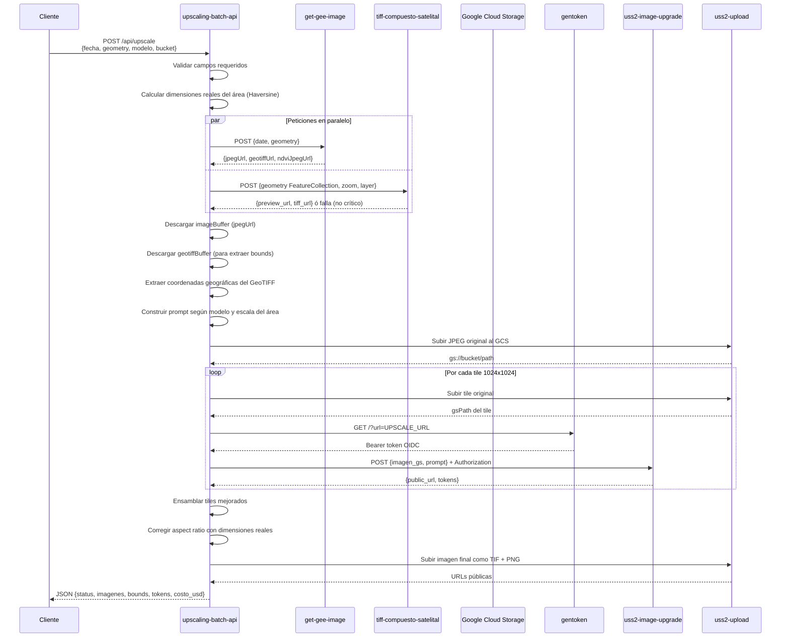
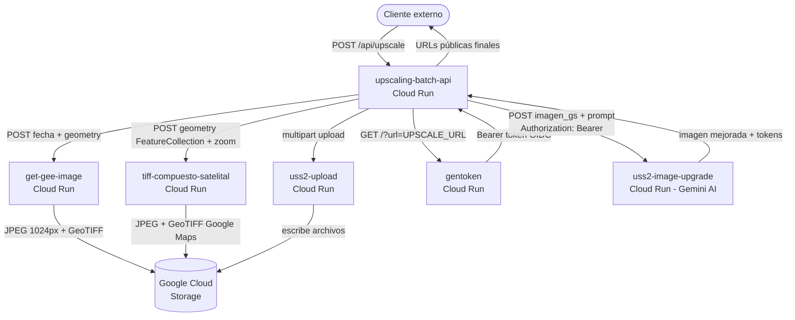

# upscaling-batch-api

Servicio REST sincrónico que expone el pipeline de **mejora de imágenes satelitales Sentinel-2** como un endpoint HTTP consumible en batch. Permite a sistemas externos (scripts, pipelines de datos, otros servicios) solicitar el procesamiento de un área geográfica y recibir las imágenes mejoradas con IA directamente en la respuesta, sin necesidad de interfaz de usuario.

Fue creado para separar la lógica de procesamiento de la aplicación web UpScaling y permitir su uso programático en procesos automatizados.

**Tecnologías:** Node.js 18+, Express 5, Sharp, GeoTIFF, Gemini AI (via Vertex AI), Google Cloud Run, Google Cloud Storage.

**URL del servicio desplegado:**
```
https://upscaling-batch-api-960956212831.us-central1.run.app/api/upscale
```

---

## Tabla de contenidos

1. [Prerequisitos](#prerequisitos)
2. [Flujo de la aplicación](#flujo-de-la-aplicación)
3. [Comunicación entre microservicios](#comunicación-entre-microservicios)
4. [¿Qué hace cada microservicio?](#qué-hace-cada-microservicio)
5. [Estructura del proyecto](#estructura-del-proyecto)
6. [Variables de entorno](#variables-de-entorno)
7. [Ejecución local](#ejecución-local)
8. [Despliegue en Cloud Run](#despliegue-en-cloud-run)
9. [API Reference](#api-reference)
10. [Modelos disponibles](#modelos-disponibles)
11. [Ejemplos de uso](#ejemplos-de-uso)
12. [Costo y tokens](#costo-y-tokens)
13. [Consideraciones técnicas](#consideraciones-técnicas)

---

## Prerequisitos

Antes de desplegar, verificar que lo siguiente esté disponible:

| Requisito | Verificación |
|---|---|
| `gcloud` CLI instalado y autenticado | `gcloud auth login` |
| Proyecto GCP configurado | `gcloud config set project emuclient` |
| APIs habilitadas | `gcloud services enable run.googleapis.com cloudbuild.googleapis.com` |
| Bucket GCS existente | `gsutil ls gs://uss2-images` |
| Permisos del SA sobre el bucket | Ver sección de despliegue |
| Los 5 microservicios dependientes desplegados | Ver sección de microservicios |
| Node.js ≥ 18 (solo para pruebas locales) | `node --version` |

---

## Flujo de la aplicación

Ciclo de vida completo de una petición, desde que entra el JSON hasta que se retorna la respuesta:



---

## Comunicación entre microservicios



---

## ¿Qué hace cada microservicio?

### `get-gee-image`
**Qué hace:** Se conecta a Google Earth Engine, descarga la imagen Sentinel-2 más cercana a la fecha indicada para el área geográfica dada, la convierte a JPEG 1024×1024 (redimensionada por emuclient) y la guarda en GCS junto con el GeoTIFF original.

**Por qué es necesario:** Sentinel-2 es la fuente de datos satelitales de 10m/px. Sin esta imagen, no hay nada que mejorar con la IA.

**Retorna:** `jpegUrl` (imagen para Gemini), `geotiffUrl` (para extraer coordenadas), `ndviJpegUrl` (índice de vegetación si aplica).

**Si falla:** El proceso se detiene — es crítico. ✅

---

### `tiff-compuesto-satelital`
**Qué hace:** Descarga tiles de Google Maps Satelital para el área indicada y los ensambla en una sola imagen compuesta (JPEG + GeoTIFF).

**Por qué es necesario:** Algunos modelos como `upscaling_google_maps` necesitan una imagen de referencia de alta resolución para que Gemini entienda el contexto geográfico (dónde están las carreteras, edificios, límites urbanos) sin copiarlo visualmente.

**Retorna:** `preview_url` (JPEG de referencia), `tiff_url` (GeoTIFF descargable).

**Si falla:** El proceso continúa — no es crítico. Solo afecta a `upscaling_google_maps`. ❌ (no crítico)

---

### `gentoken`
**Qué hace:** Genera un token OIDC de corta duración firmado por la cuenta de servicio del entorno, válido para llamar a un servicio Cloud Run específico (el `audience` es la URL de `uss2-image-upgrade`).

**Por qué es necesario:** `uss2-image-upgrade` requiere autenticación. Sin el token Bearer, la llamada a Gemini es rechazada con 401/403.

**Si falla:** El proceso se detiene — es crítico. ✅

---

### `uss2-image-upgrade`
**Qué hace:** Recibe una imagen desde GCS y un prompt de texto, llama a Gemini 2.0 Flash (modelo de imagen) via Vertex AI, y retorna la imagen mejorada junto con los metadatos de tokens consumidos.

**Por qué es necesario:** Es el núcleo del sistema — aquí es donde la IA realiza la mejora de resolución perceptual de la imagen Sentinel-2.

**Si falla:** El proceso se detiene — es crítico. Tiene reintentos automáticos (3 intentos). ✅

---

### `uss2-upload`
**Qué hace:** Recibe un archivo via multipart/form-data y lo guarda en Google Cloud Storage en la ruta indicada.

**Por qué es necesario:** El servicio principal no escribe directamente en GCS para mantener el código desacoplado de las credenciales de storage. El upload CF centraliza esa responsabilidad.

**Si falla:** El proceso se detiene — es crítico. ✅

---

## Estructura del proyecto

```
upscaling-batch-api/
├── server.js                       ← Entry point. Express app con timeout de 10 minutos.
├── deploy.sh                       ← Comando de despliegue a Cloud Run.
├── env.yaml                        ← Variables de entorno para despliegue Cloud Run.
├── package.json                    ← Dependencias y scripts.
├── .env                            ← Variables de entorno locales.
└── src/
    ├── routes/
    │   └── upscale.routes.js       ← Define POST /api/upscale. Valida campos requeridos.
    ├── services/
    │   ├── upscale.service.js      ← Pipeline principal completo. Orquesta todo el proceso.
    │   ├── gee.service.js          ← Llama a get-gee-image CF para obtener Sentinel-2.
    │   ├── tiff.service.js         ← Llama a tiff-compuesto-satelital CF para Google Maps.
    │   └── hooks.service.js        ← Hook post-proceso vacío. Listo para BQ, notificaciones, etc.
    └── utils/
        ├── gcs.js                  ← Subida y descarga de archivos (GCS y URLs públicas).
        ├── geometry.js             ← Cálculos geoespaciales con Haversine. Extracción de bounds.
        ├── prompts.js              ← Prompts por modelo + cláusula dinámica de escala espacial.
        └── costs.js                ← Cálculo de costo en USD basado en tokens consumidos.
```

---

## Variables de entorno

Crear un archivo `.env` en la raíz del proyecto con las siguientes variables:

| Variable | Descripción | Requerida |
|---|---|---|
| `PORT` | Puerto del servidor HTTP | ❌ (default: 8080) |
| `TOKEN_URL` | URL del CF que genera tokens OIDC para autenticar llamadas a Gemini | ✅ |
| `UPSCALE_URL` | URL del CF de mejora de imagen con Gemini AI | ✅ |
| `UPLOAD_URL` | URL del CF que sube archivos a Google Cloud Storage | ✅ |
| `GEE_URL` | URL del CF de Google Earth Engine (descarga Sentinel-2) | ✅ |
| `TIFF_URL` | URL del CF que genera el mosaico satelital compuesto de Google Maps | ✅ |
| `GEMINI_INPUT_PRICE_PER_M` | Precio en USD por millón de tokens de entrada (default: 0.10) | ❌ |
| `GEMINI_OUTPUT_TEXT_PRICE_PER_M` | Precio en USD por millón de tokens de salida texto (default: 0.40) | ❌ |
| `GEMINI_OUTPUT_IMAGE_PRICE_PER_M` | Precio en USD por millón de tokens de salida imagen (default: 30.00) | ❌ |

```env
PORT=8080
TOKEN_URL=https://gentoken-960956212831.us-central1.run.app
UPSCALE_URL=https://uss2-image-upgrade-960956212831.us-central1.run.app
UPLOAD_URL=https://uss2-upload-960956212831.us-central1.run.app
GEE_URL=https://get-gee-image-209592542335.us-east1.run.app
TIFF_URL=https://tiff-compuesto-satelital-960956212831.us-east1.run.app
GEMINI_INPUT_PRICE_PER_M=0.10
GEMINI_OUTPUT_TEXT_PRICE_PER_M=0.40
GEMINI_OUTPUT_IMAGE_PRICE_PER_M=30.00
```

---

## Ejecución local

```bash
# Instalar dependencias
npm install

# Correr en modo desarrollo (hot reload)
npm run dev

# Correr en modo producción
npm start
```

El servidor queda disponible en `http://localhost:8080`.

---

## Despliegue en Cloud Run

### 1. Autenticarse y configurar el proyecto

```bash
gcloud auth login
gcloud config set project emuclient
```

### 2. Verificar permisos del Service Account sobre el bucket

Cloud Run usa el SA `PROJECT_NUMBER-compute@developer.gserviceaccount.com`. Debe tener acceso al bucket:

```bash
gsutil iam ch serviceAccount:960956212831-compute@developer.gserviceaccount.com:objectAdmin gs://uss2-images
```

### 3. Desplegar

```bash
gcloud run deploy upscaling-batch-api --source . --region us-central1 --allow-unauthenticated --timeout=600 --memory=1Gi --set-env-vars "TOKEN_URL=https://gentoken-960956212831.us-central1.run.app" --set-env-vars "UPSCALE_URL=https://uss2-image-upgrade-960956212831.us-central1.run.app" --set-env-vars "UPLOAD_URL=https://uss2-upload-960956212831.us-central1.run.app" --set-env-vars "GEE_URL=https://get-gee-image-209592542335.us-east1.run.app" --set-env-vars "TIFF_URL=https://tiff-compuesto-satelital-960956212831.us-east1.run.app" --set-env-vars "GEMINI_INPUT_PRICE_PER_M=0.10" --set-env-vars "GEMINI_OUTPUT_TEXT_PRICE_PER_M=0.40" --set-env-vars "GEMINI_OUTPUT_IMAGE_PRICE_PER_M=30.00"
```

> **Nota:** El `--timeout=600` (10 minutos) es necesario porque el procesamiento completo de una imagen tarda entre 2 y 5 minutos dependiendo del número de tiles.

---

## API Reference

### `POST /api/upscale`

#### Request Body

| Campo | Tipo | Requerido | Descripción |
|---|---|---|---|
| `fecha` | `string` | ✅ | Fecha de la imagen Sentinel-2 en formato `YYYY-MM-DD` |
| `geometry` | `GeoJSON Polygon` | ✅ | Área geográfica a procesar (solo tipo `Polygon`, no FeatureCollection) |
| `modelo` | `string` | ✅ | Modelo de IA a utilizar (ver [Modelos disponibles](#modelos-disponibles)) |
| `bucket` | `string` | ✅ | Nombre del bucket de GCS donde se guardarán los resultados |
| `proyecto` | `string` | ❌ | Nombre del proyecto (solo informativo) |
| `prompt` | `string` | ❌ | Prompt personalizado (requerido solo cuando `modelo` es `Custom`) |

#### Response

```json
{
  "status": "complete",
  "modelo": "upscaling",
  "area_km2": 11.091,
  "imagenes": {
    "sentinel2_jpeg": "https://storage.googleapis.com/uss2-images/sentinel/original_jpeg/batch_xxx.jpeg",
    "sentinel2_tif": "https://storage.googleapis.com/uss2-images/sentinel/sentinel_rgb_xxx.tif",
    "mejorada_png": "https://storage.googleapis.com/uss2-images/sentinel/resultados_previsualizacion/batch_xxx.png",
    "mejorada_tif": "https://storage.googleapis.com/uss2-images/sentinel/resultados_finales/batch_xxx.tif",
    "google_maps_jpeg": "https://storage.googleapis.com/...",
    "google_maps_tif": "https://storage.googleapis.com/...",
    "ndvi_jpeg": null
  },
  "bounds": [
    [-74.12008392423013, 4.679953135677471],
    [-74.08999036221212, 4.710046697695475]
  ],
  "tokens": {
    "input": 1881,
    "output": 1313,
    "total": 3194
  },
  "costo_usd": 0.039578
}
```

#### Descripción de los campos de la respuesta

| Campo | Descripción |
|---|---|
| `imagenes.sentinel2_jpeg` | Imagen Sentinel-2 original convertida a JPEG 1024×1024. Es la que recibió Gemini. |
| `imagenes.sentinel2_tif` | GeoTIFF original de Sentinel-2. Tiene las coordenadas geoespaciales embebidas. |
| `imagenes.mejorada_png` | Imagen mejorada por Gemini en formato PNG. Lista para visualizar en un mapa. |
| `imagenes.mejorada_tif` | Imagen mejorada en formato GeoTIFF con compresión LZW. Lista para descarga y análisis GIS. |
| `imagenes.google_maps_jpeg` | Mosaico de Google Maps satelital del área (solo disponible si el modelo lo solicita). |
| `imagenes.google_maps_tif` | Mosaico de Google Maps en GeoTIFF. |
| `imagenes.ndvi_jpeg` | Mapa NDVI (índice de vegetación). Solo disponible con `upscaling_ndvi`. |
| `bounds` | Coordenadas exactas `[minLng, minLat], [maxLng, maxLat]` extraídas del GeoTIFF. Usadas para posicionar la imagen en un visor de mapas. |
| `tokens` | Tokens consumidos en Gemini (acumulado de todos los tiles). |
| `costo_usd` | Costo estimado en USD del procesamiento con Gemini. |

#### Errores

| Código | Causa |
|---|---|
| `400` | Falta un campo requerido (`fecha`, `geometry`, `modelo` o `bucket`) |
| `500` | Error interno (GEE no disponible, Gemini falló, GCS sin permisos, etc.) |

---

## Modelos disponibles

### Mejora fotorrealista

| Modelo | Descripción | Usa Google Maps | Cuándo usarlo |
|---|---|---|---|
| `upscaling` | Mejora Sentinel-2 de 10m/px a ~1m/px equivalente. Fotorrealista. | ❌ | Caso de uso general |
| `upscaling_google_maps` | Igual que `upscaling` pero con mosaico de Google Maps como referencia geográfica | ✅ | Cuando se necesita más precisión en límites urbanos |
| `upscaling_ndvi` | Mejora el mapa de índice de vegetación NDVI. Preserva valores científicos. | ❌ | Análisis de cobertura vegetal |

### Mapas temáticos GIS _(nuevos)_

| Modelo | Descripción | Usa Google Maps | Cuándo usarlo |
|---|---|---|---|
| `construcciones` | Mapa coroplético de huellas de edificios. Cada edificio se colorea con un color sólido distinto (azul, naranja, teal, etc.) sobre fondo gris claro. Calles como corredores blancos. Inspirado en datasets de building footprints estilo NYC / OpenStreetMap. | ✅ | Visualización de tejido urbano y densidad edilicia |
| `urbano_rural` | Clasificación supervisada de uso del suelo (LULC) al estilo teledetección. Cada categoría (urbano, bosque, cultivos, suelo desnudo, agua, pastizal) se renderiza con un color sólido único cubriendo toda la imagen. Fidelidad geométrica estricta al trazado real de manzanas y calles de la imagen de referencia. | ✅ | Análisis de cobertura y uso del suelo |
| `conurbacion` | Mapa de morfología urbana que muestra múltiples núcleos urbanos separados, cada uno en una paleta de color distinta (zona A azul, zona B naranja, etc.), con línea negra gruesa en el límite entre núcleos. Fondo blanco en áreas no urbanizadas. Solo dibuja edificios donde realmente existen en la referencia. | ✅ | Análisis de conurbación y expansión urbana policéntrica |

### Detección de elementos específicos

| Modelo | Descripción | Usa Google Maps | Cuándo usarlo |
|---|---|---|---|
| `building_footprint` | Resalta huellas de edificios en rojo sobre la imagen | ✅ | Detección rápida de construcciones |
| `ways` | Resalta carreteras y caminos en amarillo | ❌ | Análisis de infraestructura vial |
| `forest` | Resalta zonas boscosas en verde vibrante | ❌ | Análisis de cobertura forestal |
| `trees` | Resalta árboles individuales o pequeños grupos | ❌ | Análisis de vegetación urbana |

### Personalizado

| Modelo | Descripción | Usa Google Maps | Cuándo usarlo |
|---|---|---|---|
| `Custom` | Prompt completamente personalizado. Requiere campo `prompt` en el body. | ✅ | Casos de uso específicos no cubiertos por los modelos anteriores |

---

## Ejemplos de uso

### Ejemplo 1 — Upscaling estándar

Mejora una imagen Sentinel-2 del área sin referencia adicional.

```json
{
  "fecha": "2024-06-15",
  "geometry": {
    "type": "Polygon",
    "coordinates": [[
      [-74.12, 4.68],
      [-74.09, 4.68],
      [-74.09, 4.71],
      [-74.12, 4.71],
      [-74.12, 4.68]
    ]]
  },
  "modelo": "upscaling",
  "bucket": "uss2-images",
  "proyecto": "emuclient"
}
```

---

### Ejemplo 2 — Upscaling con referencia Google Maps

Gemini recibe la imagen Sentinel-2 **y** un mosaico de Google Maps satelital del mismo área. Usa el mosaico solo para orientación geográfica, no para copiar su estilo visual.

```json
{
  "fecha": "2024-06-15",
  "geometry": {
    "type": "Polygon",
    "coordinates": [[
      [-74.2751347924506, 4.504419182396205],
      [-74.22717025036965, 4.504419182396205],
      [-74.22717025036965, 4.538748088196101],
      [-74.2751347924506, 4.538748088196101],
      [-74.2751347924506, 4.504419182396205]
    ]]
  },
  "modelo": "upscaling_google_maps",
  "bucket": "uss2-images",
  "proyecto": "emuclient"
}
```

---

### Ejemplo 3 — Custom: detección de cuerpos de agua

Usa un prompt completamente personalizado para resaltar ríos, humedales y terrenos inundados en cian sobre la imagen.

```json
{
  "fecha": "2024-06-15",
  "geometry": {
    "type": "Polygon",
    "coordinates": [[
      [-74.2751347924506, 4.504419182396205],
      [-74.22717025036965, 4.504419182396205],
      [-74.22717025036965, 4.538748088196101],
      [-74.2751347924506, 4.538748088196101],
      [-74.2751347924506, 4.504419182396205]
    ]]
  },
  "modelo": "Custom",
  "bucket": "uss2-images",
  "proyecto": "emuclient",
  "prompt": "Generate a satellite image highlighting all water bodies, rivers, streams, wetlands and flooded terrain in bright cyan blue. Preserve the original Sentinel-2 land cover for all non-water areas. Apply high contrast between water and non-water zones. Do not invent water where none exists in the original image."
}
```

---

## Costo y tokens

El costo se calcula automáticamente y se incluye en cada respuesta en el campo `costo_usd`.

### Precios Gemini 2.0 Flash (configurables via env vars)

| Tipo | Precio por millón de tokens |
|---|---|
| Input (texto + imagen enviada) | $0.10 USD |
| Output texto | $0.40 USD |
| Output imagen (generada) | $30.00 USD |

### Ejemplo de costo real

Con 1 tile de 1024×1024:
- Input: ~1,881 tokens → $0.000188 USD
- Output imagen: ~1,313 tokens → $0.039390 USD
- **Total: ~$0.039 USD por imagen**

> El costo principal está en el output de imagen ($30/M tokens). Una imagen de 1024×1024 genera aproximadamente 1,300 tokens de salida.

---

## Consideraciones técnicas

### ¿Por qué la imagen procesada siempre mide 1024×1024 antes de la corrección?

El microservicio `get-gee-image` (emuclient) fuerza todas las imágenes a 1024×1024 al convertir el GeoTIFF a JPEG. Esto garantiza que Gemini siempre reciba imágenes de tamaño consistente independientemente del área seleccionada.

### ¿Cómo se corrige el aspect ratio?

Después de que Gemini genera los tiles mejorados (todos cuadrados), el servicio calcula las dimensiones reales del área en metros usando la fórmula de Haversine y reescala la imagen compuesta al aspect ratio correcto. Por ejemplo, un área de 3.3km × 3.0km produce una imagen final de 1024×930px en lugar de 1024×1024px.

### ¿Por qué se generan tiles?

Gemini tiene un límite de tamaño de imagen por petición. El servicio divide la imagen en tiles de 1024×1024 y los procesa en paralelo. Para áreas pequeñas siempre resulta en 1 tile.

### Resolución real vs resolución visual

Sentinel-2 tiene una resolución nativa de **10 metros por píxel**. La IA no añade datos reales — mejora la calidad visual, el contraste y la definición de bordes de manera que la imagen *se percibe* como de mayor resolución. No recupera información que no existía en el sensor.

### La fecha solo afecta a Sentinel-2

El mosaico de Google Maps es estático — no cambia con la fecha. La fecha determina qué captura de Sentinel-2 se usa (el satélite pasa por el mismo lugar cada ~5 días). Una mala fecha (temporada de lluvias) resulta en imágenes con nubes.

### Extensión del hook post-proceso

El archivo `src/services/hooks.service.js` contiene una función `onJobComplete(result)` vacía que se ejecuta al finalizar cada proceso. Es el punto de extensión para integrar BigQuery, Google Sheets, Pub/Sub, notificaciones, etc. sin modificar la lógica principal.
